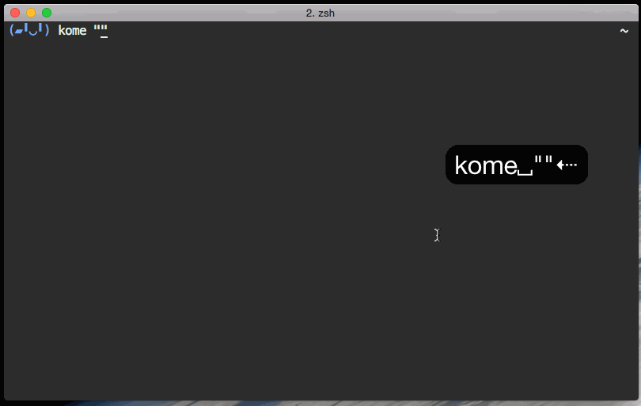

# kome

kome is Terminal Niconama Comment Viewer



## Requirement
- go >=1.4.1

## Installation

    $ go get github.com/kroton/kome
    
## Configuration
~/.config/kome/account.json
```json
{
    "mail": "mail@example.com",
    "password": "password"
}
```

## Usage
    $ kome lv112233
    $ kome http://live.nicovideo.jp/watch/lv112233
    $ kome http://live.nicovideo.jp/watch/lv112233?ref=....
    
## KeyBind
| Key | Description |
|:---:|:---:|
| : | move to command mode |
| :q, q | exit |
|Ctrl+C| force exit |
| i | move to comment send mode |
| :184 hoge | send "hoge" as anonymity comment |
| j | move to comment below |
| k | move to upper comment |
| 22G | move to 22nd comment |
| :22 | move to 22nd comment |
| gg | move to first comment |
| G | move to last comment |
|ESC, Ctrl+[|back to main view|
