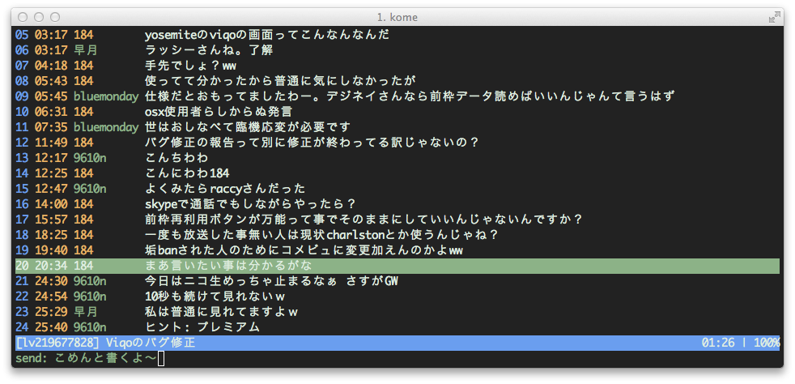

# kome

Terminal Niconama Comment Viewer



## Requirement
- go >=1.4.1

## Installation

    $ go get github.com/kroton/kome
    
## Setting
~/.config/kome/config.json
```json
{
    "mail": "mail@example.com",
    "password": "password"
}
```

## Usage
    $ kome lv112233
    $ kome http://live.nicovideo.jp/watch/lv112233
    $ kome http://live.nicovideo.jp/watch/lv112233?ref=....
